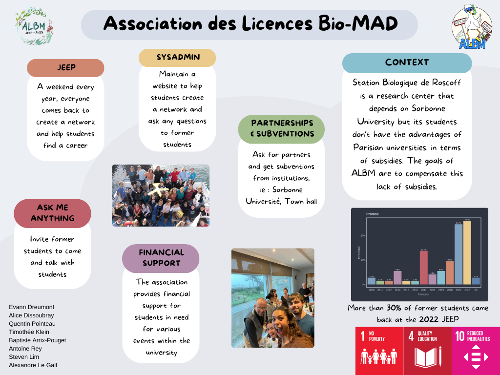

From being the author of the [ALBM.fr](https://albm.fr) website in 2022 to assuming the role of association president in early 2023, my journey has been a dynamic shift towards leadership. The ALBM, was established to assist students in building networks, finding direction, and exploring the professional world, primarily achieves these goals through events like the annual JEEP weekend in Roscoff. As president, my responsibilities span website management, communication, event coordination, and partnerships, leading a team of eight dedicated individuals.

Notably, we pitched for the ALBM during the Civic Engagement team presentation at ENSEEIHT and secured the 3rd position, highlighting the association's relevance. The association continues to be a vital hub, connecting students and alumni, and stands as a testament to community-driven initiatives in shaping students' futures. Our commitment remains unwavering as we empower students and cultivate a supportive community for the challenges and triumphs that lie ahead.

