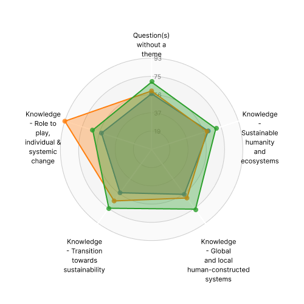

At the end of last year, I had the opportunity to take the Sulitest "Awareness Test" at ENSEEIHT. This renowned tool, developed by the European Sustainability Academy (ESA), aims to enhance and measure awareness of sustainability issues. The test consists of 30 international multiple-choice questions from an expert-approved database, each linked to one or more Sustainable Development Goals (SDGs). By mapping citizen awareness of the SDGs, Sulitest creates a valuable research resource. Additionally, demographic data collected through a voluntary survey adds to its research potential. Beyond the Core Module, customized modules for countries, specific SDGs, or unique topics can be added. Taking this test at ENSEEIHT was an enlightening experience that underscored the importance of sustainability awareness in our daily lives and decision-making processes.

